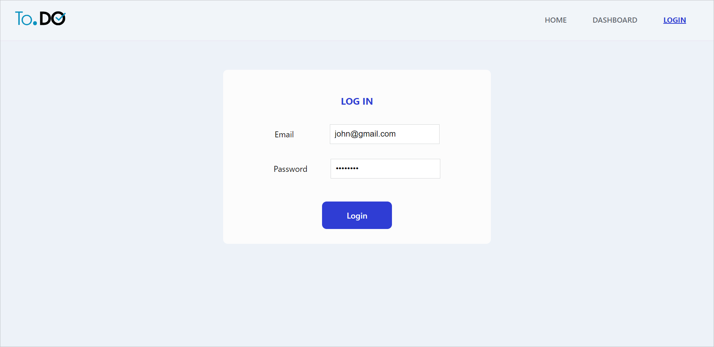
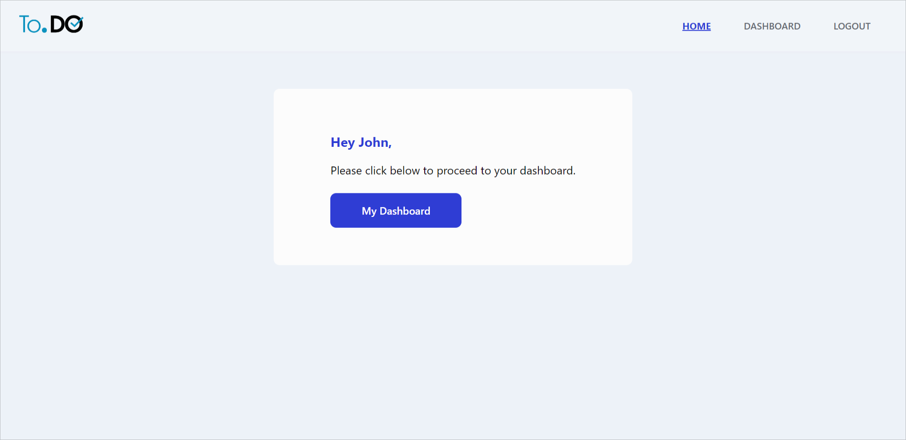
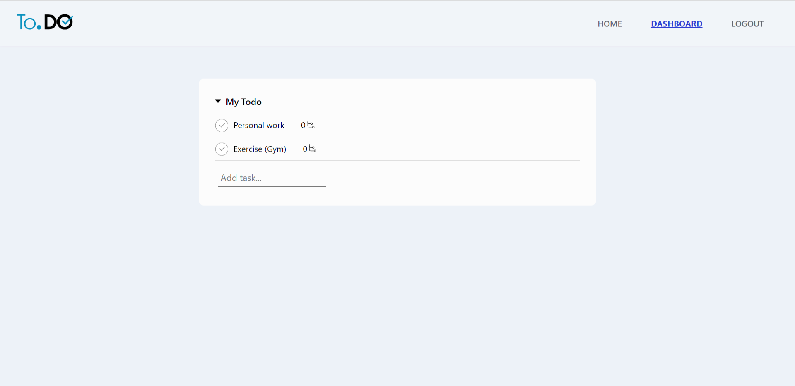
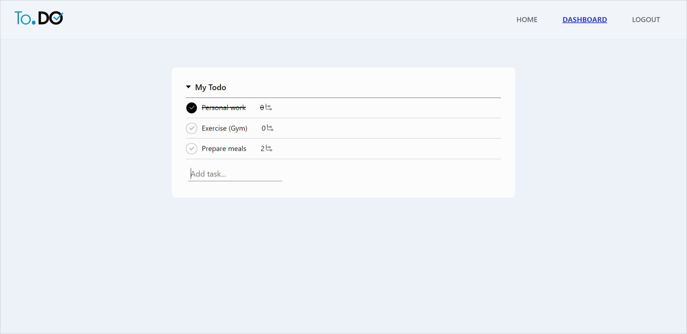
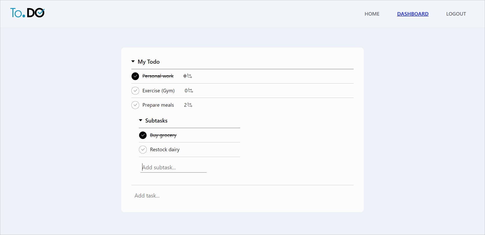
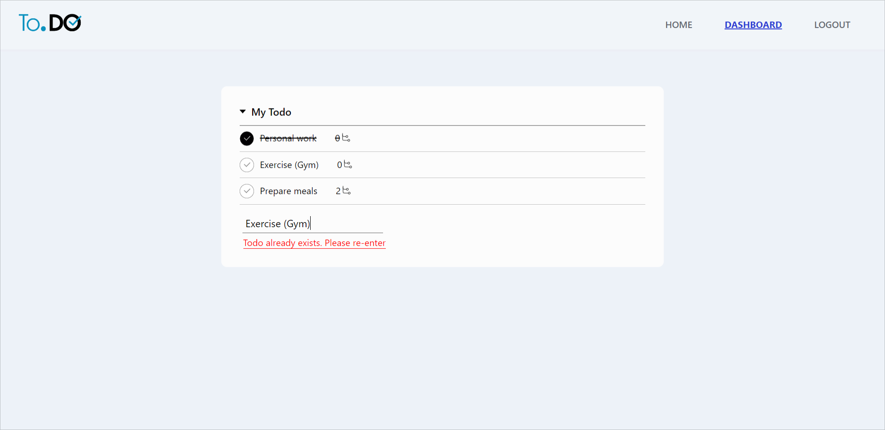

# Todo List

A modern and lightweight todo list application.

## Technology stack

- React.js
- React Router
- CSS Modules

## Functionalities

- User Login
- Add todo item
- Toggle todo item
- Add sub-tasks for a todo item
- Toggle sub-tasks for a todo item

## Screenshots

## Note

- To login to the application, you can find the test credentials [here](./src/constants/users.json).
